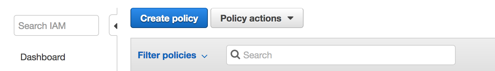
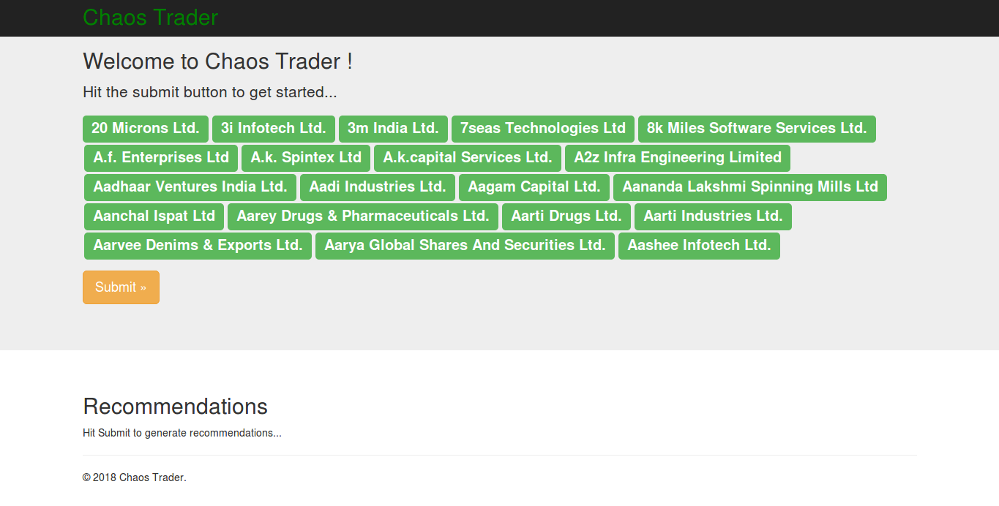
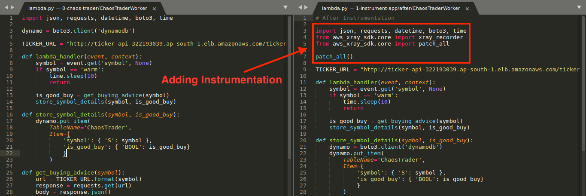
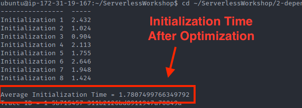
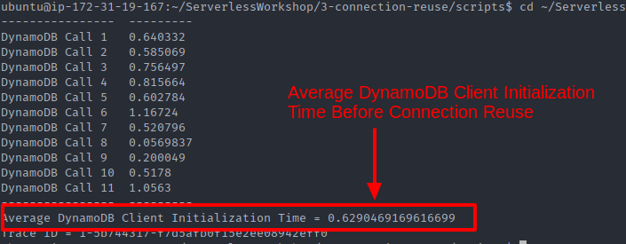
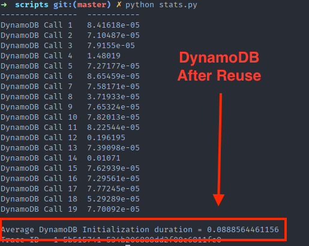
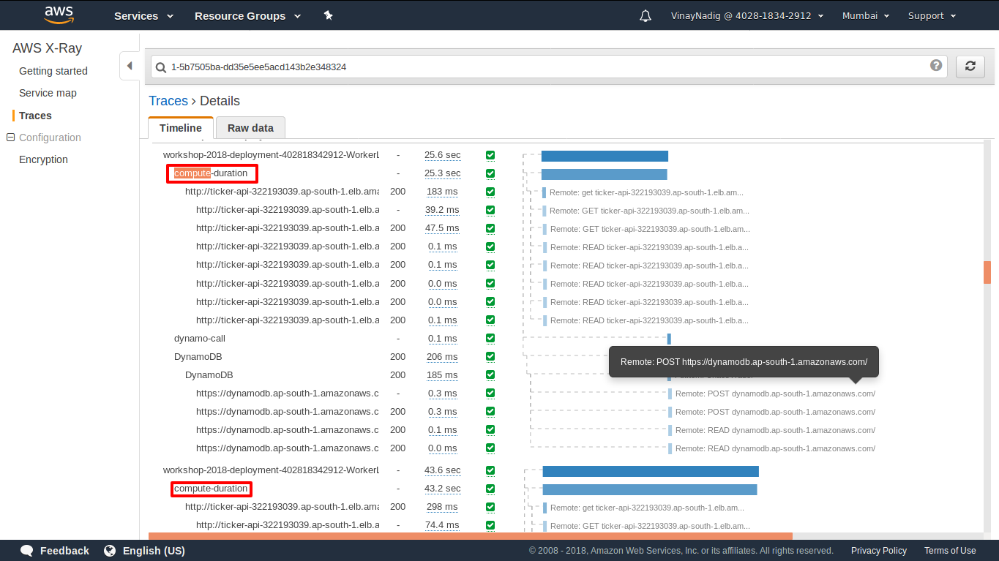

# Serverless Optimization Workshop


In this workshop, you will deploy a simple Web Application called **ChaosTrader**. The application will give you indications on whether or not buying a particular Stock is a good idea in the long run. The application is a Single Page App. A list of Stock Symbols will be sent to the backend API which will process the Symbols asynchronously and update the viability of the Stock in a DynamoDB table. This table is in turn queried again and the results are displayed in the Web App.

The application architecture uses [AWS Lambda](https://aws.amazon.com/lambda), [Amazon API Gateway](https://aws.amazon.com/api-gateway/) and [DynamoDB](https://aws.amazon.com/dynamodb/). Static assets including HTML, CSS, JavaScript & Images are stored on S3. [AWS X-Ray](https://aws.amazon.com/xray/) will be used to measure the performance of the application.

Once the application is deployed, you will successively apply best practices to the backend application and measure the performance before and after the best practice has been applied using X-Ray.

## Prerequisites

#### AWS Account

You will need an AWS Account to complete this workshop. You will run into issues if you are sharing the AWS Account with another user who is participating in the same workshop.

#### IAM Role

Create an IAM role by with these steps.

1. Navigate to [Create Policy Page in the IAM Console](https://console.aws.amazon.com/iam/home#/policies)

2. Select Create Policy


3. Paste the following JSON in the JSON tab

```json
{
    "Version": "2012-10-17",
    "Statement": [
        {
            "Effect": "Allow",
            "Action": [
                "cloudformation:*"
            ],
            "Resource": "*"
        }
    ]
}
```

4. Name the policy CloudFormationFullAccess


5. Navigate to [Create Role Page in the IAM Console](https://console.aws.amazon.com/iam/home?region=ap-south-1#/roles$new?step=type)

6. Select "EC2" as the Service that will use the role and click Next.

   

7. Select the following Amazon Managed Policies from the Role List and click 'Next'.
   1. AWSLambdaFullAccess
   2. AmazonAPIGatewayAdministrator
   3. CloudWatchFullAccess
   4. IAMFullAccess
   5. AWSXrayFullAccess
   6. AmazonDynamoDBFullAccess
   7. CloudFormationFullAccess
   8. AmazonS3FullAccess 

8. Enter the Role name as 'Serverless-Workshop-EC2-Role' and click 'Create Role' Button.

   


#### EC2 Instance

You will need a local Command Line Interface to run the SAM & CloudFormation commands. Easiest option is to launch an EC2 Instance with Ubuntu OS and install required permissions.

Launch an EC2 Instance with the '*<u>ami-188fba77</u>*' AMI Id and associate the 'Serverless-Workshop-EC2-Role' role. Leave the rest of the settings at default.


#### Install Dependencies

Once launched, SSH into the EC2 Instance and run the following commands to install the dependencies.

* Python3 with Pip
    ```bash
    sudo apt-get update && sudo apt-get -y install python3-pip git build-essential
    ```

* AWS CLI
    ```bash
    pip3 install awscli
    ```

* SAM CLI
    ```bash
    pip3 install aws-sam-cli
    ```

* Zip
    ```bash
    sudo apt-get -y install zip
    ```

* Tabulate

    ```bash
    pip3 install tabulate
    ```

    ​

#### Modules

The workshop is divided into the following modules.

* **Base Deployment** - Deploy the base Application.
* **Instrumentation** - Instrument the deployed Application with AWS XRay
* **Dependency Management** - Reduce the size of your package size and measure the impact of package size on performance.
* **Connection Reuse** - Reuse connections between multiple invocations of Lambda and measure the performance difference.
* **Synthetic Events** - If you are hitting cold start issues, trigger synthetic events to keep a warm pool of Lambdas ready to be used.
* **MultiThreading** - Allocate more than 1.8GB of Memory to your Lambda Function and take advantage of the multiple vCPUs allocated.

In each of the above steps you will be measuring the performance before and after the best practice has been applied.

## Workshop - Module 0 - Base Deployment

In this module, we will deploy the base application using SAM. This will create the necessary API endpoints, Lambda Functions and the DynamoDB table.

#### Clone the Repository

Clone the repository locally and change into the cloned directory

```bash
git clone https://github.com/aamirhakim88/ServerlessWorkshop.git && cd ServerlessWorkshop
```

#### Deploy the Base Application

```bash
./deploy.sh -s 0
```

This will create a Cloudformation Template and after successful completion, will output the API endpoint where the application can be accessed.


Access the application at output URL of the "URL for ChaosTrader UI" OutputKey.

You should see a screen similar to this.



This will deploy the Application for which we will apply the Optimizations. This completes Module 0 of the workshop.

## Workshop - Module 1 - X-Ray Instrumentation

In this module, we will instrument the Lambda Functions with AWS X-Ray and have a look at the X-Ray console to check the current performance of the application. The Instrumented Lambda code resides in `ServerlessWorkshop/1-instrument-app/after` folder. We encourage you to go through `lambda.py` files in the `ServerlessWorkshop/1-instrument-app/after/ChaosTraderMaster` and `ServerlessWorkshop/1-instrument-app/after/ChaosTraderWorker` folder.

#### Lambda Instrumentation Code



The Lambda functions will have the following lines of code.

```python
from aws_xray_sdk.core import xray_recorder
from aws_xray_sdk.core import patch_all

patch_all()
```

With this code, Lambda now instruments every call it makes to other AWS Resources and External Endpoints.


#### Deploy the Instrumented Application

Deploy the application with the following command and choose '2' when prompted for input.

```bash
cd ~/ServerlessWorkshop && ./deploy.sh -s 1

Enter Version Option [1 (Unoptimized) | 2 (Optimized)]: 2
```

#### Run the Application

Once the deployment is complete, navigate to the Application in your browser and click the **Submit** button. This will send a POST request to the API Endpoint which will in turn trigger the instrumented Lambda Functions. You will also start seeing the Name of the Companies starting to appear at the bottom of the screen with an indicator on whether or not to buy the Stock.


#### Check X-Ray Console

Navigate to [X-Ray Console](https://ap-south-1.console.aws.amazon.com/xray/home?region=ap-south-1#/service-map). You should see a Service Graph similar to the one below.

**Note**: It usually takes a couple of minutes for XRay to get the data.


Go through the Nodes denoted in the Service Map. Each Node represents a specific component of the Application. Each Node also has the average duration that the request spent in that stage and the average number of Traces that were sampled in that stage.

Navigate to the [Traces Section](https://ap-south-1.console.aws.amazon.com/xray/home?region=ap-south-1#/traces) of the X-Ray console. It will contain a list of the most recent Traces.

**Note**: If you don't see any data in the console, try setting the time interval to a higher value.


Click on any of the Traces listed and you should see a screen with the Trace details.


Click on any of the Duration Links to get a detailed report on any of the Segment or Subsegments.


This completes the Module 1 of the Workshop.

## Workshop - Module 2 - Dependency Management

In this module, we will first deploy the Application with a large set of dependencies and measure the performance impact. After that, we will reduce the size of the deployment package significantly and again measure the performance impact.

#### Deployment Package Size Difference


#### Deploy the Unoptimized Application with large dependency size

Deploy the application using the below command. Enter '1' when asked for an Input. This will deploy the Lambda Functions which have **50 MB** of dependencies.

```bash
cd ~/ServerlessWorkshop && ./deploy.sh -s 2

Enter Version Option [1 (Unoptimized) | 2 (Optimized)]: 1
```

#### Trigger the work flow

Once the deployment is complete, navigate to the Application in your browser and click the **Submit** button. Wait for a few  minutes for all the Stock details to be fetched.

#### Measure the Performance

To make it easier to list all the Initialization values, a script is present in the `scripts` folder. Running it will show a list of all the Initialization times and the average Initialization time across all the Lambda Functions.

```bash
cd ~/ServerlessWorkshop/2-dependency-management/scripts/ && python3 stats.py
```


If you would like to check the Initialization Times in the X-Ray console, navigate to the [Traces Section](https://ap-south-1.console.aws.amazon.com/xray/home?region=ap-south-1#/traces) of the X-Ray console and search for the Trace ID from the output of the previous script. This will bring up the details of the latest Trace. Go through the values that are listed for the **Initialization** subsegment highlighted below.


Note the Average Initialization time. Now, go ahead and deploy the code in the `ServerlessWorkshop/2-dependency-management/after/` folder. This folder has substantially lesser dependencies.

Enter '2' as input when prompted.

```bash
cd ~/ServerlessWorkshop && ./deploy.sh -s 2

Enter Version Option [1 (Unoptimized) | 2 (Optimized)]: 2
```

Once the application is deployed, Re-run the application by pressing **Submit** button again in the Application and wait for the Application to fetch the details.

Run the `stats.py` script to measure the performance post. You should see substantial decrease in the initialization time.

```bash
cd ~/ServerlessWorkshop/2-dependency-management/scripts && python3 stats.py
```




This completes the Module 2 of the workshop.

## Workshop - Module 3 - Connection Reuse

In this module, we will first deploy the application where the a DynamoDB client will be initialized on every invocation of Lambda and measure the performance. We will then update the Application to re-use the connection between invocations and measure the performance gains.

#### Connection Reuse Code


#### Deploy the Application without Connection Reuse

```bash
cd ~/ServerlessWorkshop && ./deploy.sh -s 3

Enter Version Option [1 (Unoptimized) | 2 (Optimized)]: 1
```

#### Trigger the work flow

Once the deployment is complete, navigate to the Application in your browser and click the **Submit** button.

#### Measure the Performance

Run the `stats.py` script in the `scripts` folder to see a full list of measurements for all the DynamoDB Initialization times.

```bash
cd ~/ServerlessWorkshop/3-connection-reuse/scripts && python3 stats.py
```




If you would like to check the Client Initialization time in the X-Ray Console, navigate to the [Traces Section](https://ap-south-1.console.aws.amazon.com/xray/home?region=ap-south-1#/traces) of the X-Ray console and search for the Trace ID from the output of the previous script. This will bring up the details of the latest Trace. Go through the values that are listed for the **dynamodb-call** subsegment highlighted below.


#### Deploy the Connection Re-use Optimized Application

```bash
cd ~/ServerlessWorkshop && ./deploy.sh -s 3

Enter Version Option [1 (Unoptimized) | 2 (Optimized)]: 2
```

#### Trigger the work flow

Once the deployment is complete, navigate to the Application in your browser and click the **Submit** button.

#### Measure the Performance

Run the `stats.py` script folder again to measure the Performance after the optimization has been applied.

```bash
cd ~/ServerlessWorkshop/3-connection-reuse/scripts && python3 stats.py
```




You should see a decrease in the Average Initialization time.

You will see a further drop in DyanamoDB client initialization time if you re-run the application and measure the Initialization time again. This is because, the second time the application is used, we have pre-warmed Lambdas which already have the DynamoDB client initialized and this client will be re-used instead of creating a new DynamoDB client.

This completes Module 3 of the Workshop.

## Workshop - Module 4 - Synthetic Events

In this module, we will first measure the Initialization Time of the Lambda Functions during cold-starts. After that, we will use Synthetic Events to keep a warm pool of Lambda Functions available and measure the performance gains.

#### Deploy the Application

```bash
cd ~/ServerlessWorkshop && ./deploy.sh -s 4

Enter Version Option [1 (Unoptimized) | 2 (Optimized)]: 1
```

#### Trigger the work flow

Once the deployment is complete, navigate to the Application in your browser and click the **Submit** button.

#### Measure the Performance

Run the `stats.py` script in the `scripts` folder to measure the initialization time.

```bash
cd ~/ServerlessWorkshop/4-synthetic/scripts && python3 stats.py
```


#### Deploy and trigger a Lambda Function to send Synthetic Events to the Application

```bash
cd ~/ServerlessWorkshop && ./deploy.sh -s 4

Enter Version Option [1 (Unoptimized) | 2 (Optimized)]: 2
```

This will create a new Lambda Function that sends Synthetic Events to the Application.


Trigger the Synthetic Events by sending a Test event to the new Lambda Function. This will send artificial events to the Application and keep a warm pool of Lambdas ready for use.

Once done, trigger the application launch again by clicking the **Submit** button in the Application page.

Run the `stats.py` script in the `scripts` folder to measure the Initialization time.

```bash
cd ~/ServerlessWorkshop/4-synthetic/scripts && python3 stats.py
```

The output will be

```
There were no cold starts in the application.
Trace ID = Trace ID = 1-5b744317-f7d5afb0f15e2ee08942eff0
```

To verify this, navigate to the [Traces Section](https://ap-south-1.console.aws.amazon.com/xray/home?region=ap-south-1#/traces) of the X-Ray Console and search for the Trace ID from the output of the previous script. You should not see any Initializations.


This can be verified by running the `stats.py` script in the `scripts` folder.

```bash
cd ~/ServerlessWorkshop/4-synthetic/scripts && python3 stats.py
```

The output will be

```
There were no cold starts in the application.
Trace ID = Trace ID = 1-5b744317-f7d5afb0f15e2ee08942eff0
```

This completes module 4 of the Workshop.

### Workshop - Module 5 - Parallel Processing/Multithreading

If you the set the Memory Capacity of the Lambda Function to be greater than 1.8 GB, the Lambda Function gets assigned 2 vCPUs of CPU capacity. You can now take advantage of Multithreading if your application supports it to improve the performance.

In this module, we will first measure the Execution Time of the Lambda Functions with less than 1.8 GB of memory so that only one core is available as compute capacity. After that, we will modify the Lambda Function to take advantage of multiple vCPUs and measure the gain in performance.

#### Deploy the application

```
cd ~/ServerlessWorkshop && ./deploy.sh -s 5

Enter Version Option [1 (Unoptimized) | 2 (Optimized)]: 1
```

#### Trigger the workflow

Once the deployment is complete, navigate to the Application in your browser and click the **Submit** button.

#### Measure the Performance

Run the `stats.py` script in the `scripts` folder to see a full list of measurements for all the Compute  times.

```bash
cd ~/ServerlessWorkshop/5-parallel-processing/scripts && python3 stats.py
```


If you would like to check the Compute Time Initialization time in the X-Ray Console, navigate to the [Traces Section](https://ap-south-1.console.aws.amazon.com/xray/home?region=ap-south-1#/traces) of the X-Ray console and search for the Trace ID from the output of the previous script. This will bring up the details of the latest Trace. Go through the values that are listed for the **compute-time** subsegment highlighted below.



#### Deploy the Optimized Application that uses Parallel Processing

```bash
cd ~/ServerlessWorkshop && ./deploy.sh -s 5

Enter Version Option [1 (Unoptimized) | 2 (Optimized)]: 2
```

#### Trigger the work flow

Once the deployment is complete, navigate to the Application in your browser and click the **Submit** button.

#### Measure the Performance

Run the `stats.py` script folder again to measure the Performance after the optimization has been applied.

```bash
cd ~/ServerlessWorkshop/5-parallel-processing/scripts && python3 stats.py
```


You should see a decrease in the Average Compute time.

